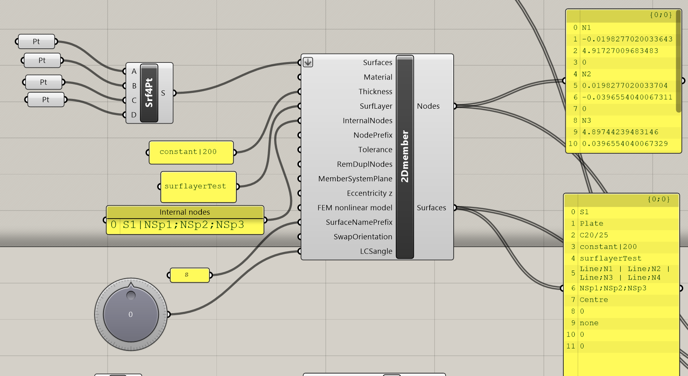

# 2D members

2D member component defines slabs or walls.

## Input

### Surfaces

List with geometrical definition of the surfaces. Supported geometrical surface shapes:

* closed polygonal shape where segments could be line, circular arc and spline.
* circular shape

### Material

Definition of the material for the 2D member. The same material naming as in SCIA Engineer have to be used e.g. C20/25, S 235 etc.

### Thickness

Definition of the thickness of 2D member. Thickness could be constant or variable. Syntax for thickness:

_thicknessType_\|_Parameters_ 

where:

* _thicknessType_
  * constant thickness: constant
  * variable thickness: variable
* _Parameters_ 
* * Constant - thickness in millimeters
  * Variable variabletype\|variableparameters
  * where
    * _variabletype_
      * Global in X direction - Global X\|Thickeness on first point;Name of first point\|Thickness on the second point in milimeteres;Name of the second point \(e.g. : Global X\|400;N1\|200; N2\)
      * Global in Y direction - syntax is similar as above only one difference is in keyword Global Y
      *  Global in Z direction **-** syntax is similar as above only one difference is in keyword Global Z
      * Local in X direction - syntax is similar as above only one difference is in keyword Local X
      * Local in Y direction - syntax is similar as above only one difference is in keyword Local Y
      * Variable in two directions 
      * Radial \(circular slabs only\)  - syntax is Radial\|Thickness in center\|thickness on radius
      * Variable in 4 pt. - syntax is Variable in 4 pt.\|First node thickness; First node\|Second node thickness; Second node\|Third node thickness; Third node\|Fourth node thickness; Fourth node  \(e.g. : Variable in 4 pt.\|400;N1\|200; N2\|300; N3\|100;N4\)

### Surflayer

List of the names of the layers where 2D members will be placed in SCIA Engineer. For definition of layers you need to create layers through Layers component. If you don't specify layers then SCIA Engineer creates default layer1.



### InternalNodes

Definition of internal nodes for surface. It has to be inputted with following syntax - _Nameof2Dmember;Node1;NodeN -_ e.g.  S1\|NSp1;NSp2;NSp3

Nodes have to be already created through component nodes and in the definition their names are used.



### NodePrefix

Prefix which is used in the naming of generated nodes. Numbering starts from 1. So if prefix is N the the first node is N1 and so one. Default value is N2D.  These names are the used as references in the case of input parameters for other components.

### Tolerance

Tolerance which is used to remove duplicate nodes \(if enabled with next input\). Default is 0.001.

### RemDuplNodes

Enables removal of duplicate nodes. Default is false.

### MemberSystemPlane

Definition of system member plane.  You can select type after right click on the input parameter. In that case all 2D members will have same type. You can also define list with type for each 2D member. In that case, use following enumeration from list

* Centre - 1
* Top - 2
* Bottom - 4

As default Center - 1 is used

### Eccentricity z

Defines eccentricity according to defined system plane

### FEM nonlinear model

Definition of FEM nonlinear model for 2D member. You can select type after right click on the input parameter. In that case all 2D members will have same type. You can also define list with type for each 2D member. In that case, use following enumeration from list

* none - 0
* Press only - 1
* Membrane - 2

As default none - 0 is used

### SurfaceNamePrefix

Prefix which is used in the naming of generated 2D members. Numbering starts from 1. So if prefix is S the the first 2DMember is S1 and so one. Default value is S.  These names are the used as references in the case of input parameters for other components.

### SwapOrientation

Defines in normal of the surface should be swapped. 

* No - 0
* Yes - 1

Default is No.

### LCSangle

Definition of rotation of local coordinate system of 2D member around local z axis.

## Output

As output from component there is string list with defined nodes and string list with defined surfaces and its properties. Both lists need to be linked to component for creation of XML file into Nodes input parameter and Surfaces input parameter.



## Example

You can see this component in the action in example 2DmemberwithOpening.



