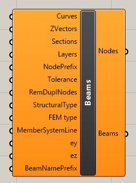
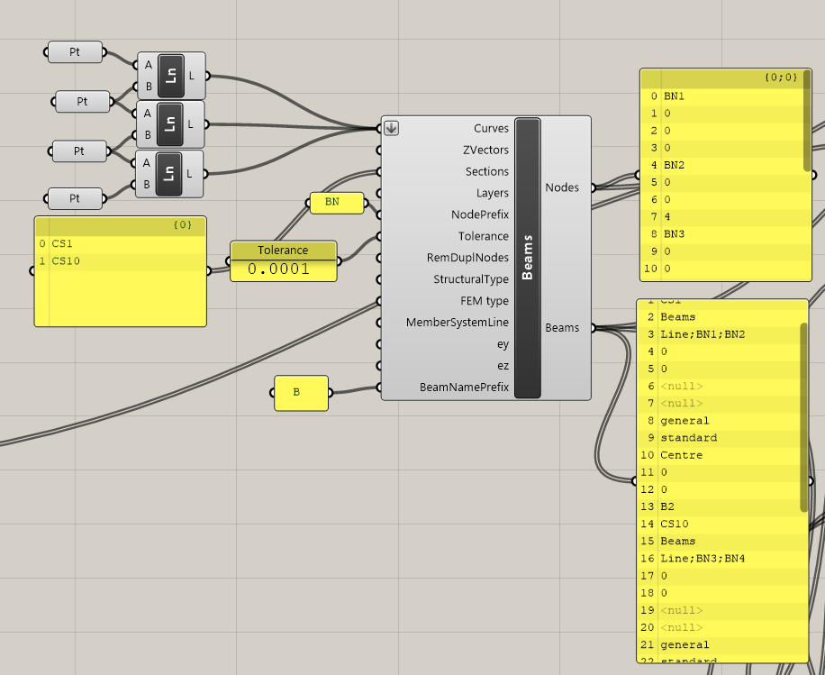

# Beams

Beam component defines all possible cross-sections which you can the use for creation of beam through beam component.

## Inputs

### Curves

As input you can use list of curves which you have created in Rhino or scripted through GH components. Supported geometrical types

* Line
* Polyline
* Arc
* Circle - you have to divide circle to 2 arcs
* Spline - for definition GrevillePoints are used.

### Zvectors

This definition is used for rotation of cross-section around beam axis. For rotation about 45deg you can define vector with components \(0,1,1\).

### Section

As an input you should use list of names of cross-sections which you defined in cross-section component. If you define 



### Layers

List of the names of the layers where beams will be placed in SCIA Engineer. For definition of layers you need to create layers through Layers component. If you don't specify layers then SCIA Engineer creates default layer1.



### NodePrefix

Prefix which is used in the naming of generated nodes. Numbering starts from 1. So if prefix is N the the first node is N1 and so one. Default value is NB.  These names are the used as references in the case of input parameters for other components.

### Tolerance

Tolerance which is used to remove duplicate nodes \(if enabled with next input\)

### RemDuplNodes

Enables removal of duplicate nodes.

### StructuralType

You can define type of the beam. You can select type after right click on the input parameter. In that case all beams will have same type. You can also define list with type for each beam. In that case, use following enumeration from list

* general - 0
* beam - 1
* column - 2
* gable column - 3
* secondary column - 4
* rafter-5
* purlin- 6
* roof bracing-7
* wall bracing - 8
* girt - 9
* truss chord- 10
* truss diagonal - 11
* plate rib - 12
* beam slab - 13

As default general - 0 is used.

### FEM type

You can define FEM type of the beam for FE analysis.  You can select type after right click on the input parameter. In that case all beams will have same type. You can also define list with type for each beam. In that case, use following enumeration from list

* standard - 0
* axial force only - 1,  beam transfer just axial force. Nonlinear calculation should be used.

As default standard - 0 is used.

### Membersystemline

You can define where system line of the beam will be located.   You can select type after right click on the input parameter. In that case all beams will have same type. You can also define list with type for each beam. In that case, use following enumeration from list

* Centre - 1
* Top - 2
* Bottom - 4
* Left - 8
* Top left - 10
* Bottom left - 12
* Right - 16
* Top right - 18
* Bottom right - 20

As default Center - 1 is used

### ey

Eccentricity of the beam in global y axis with respect to system line of the beam.

### ez

Eccentricity of the beam in global z axis with respect to system line of the beam.

### BeamNamePrefix

Prefix which is used in the naming of generated beams. Numbering starts from 1. So if prefix is B the the first beam is B1 and so one. Default value is B.  These names are the used as references in the case of input parameters for other components.

## Outputs

As output from component there is string list with defined nodes and string list with defined beams and its properties. Both lists need to be linked to component for creation of XML file into Nodes input parameter and Beams input parameter.



## Example

You can see this component in the action in example Frame



