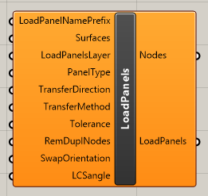

# Load panels

Load panel component defines load panels which are fictitious elements redistributing load on underlying elements.

## Input

### LoadPanelNamePrefix

Prefix which is used in the naming of generated load panels. Numbering starts from 1. So if prefix is L the the first load panel is L1 and so one. Default value is LP.  These names are the used as references in the case of input parameters for other components.

### Surfaces

List with geometrical definition of the surfaces. Supported geometrical surface shapes:

* closed polygonal shape where segments could be line, circular arc and spline.
* circular shape

### LoadPanelslayer

List of the names of the layers where load panels will be placed in SCIA Engineer. For definition of layers you need to create layers through Layers component. If you don't specify layers then SCIA Engineer creates default layer1.



### PanelType

Definition of panel type. You can select type after right click on the input parameter. In that case all load panels will have same type. You can also define list with type for each load panel. In that case, use following enumeration from list

* to panel nodes \(0\) - load will be transferred to the vertices of load panel 
* to panel edges\(1\) - load will be transferred to edges of load panel
* to panel edges and beams\(2\) - load will be transferred to edges of load panel and underlying beam

### TransferDirection

Definition of direction in which load will be distributed. You can select direction after right click on the input parameter. In that case all load panels will have same direction. You can also define list with direction for each load panel. In that case, use following enumeration from list

* X \(0\)  - load is distributed to nodes, edges and beams which are perpendicular to local axis x
* Y\(1\) - load is distributed to nodes, edges and beams which are perpendicular to local axis y
* all \(2\) - load is distributed to all nodes, edges and beams

### TransferMethod

Definition of method which will be used for distribution of the load. You can select method after right click on the input parameter. In that case all load panels will have same method. You can also define list with method for each load panel. In that case, use following enumeration from list

* standard \(1\)
* Tributary area\(3\)
* Accurate\(FEM\),fixed link with beams \(0\)
* Accurate\(FEM\),hinged link with beams \(2\)

Description and difference of the methods can be found [here](https://help.scia.net/webhelplatest/en/#her/load/panel_to_nodes_edges_and_beams.htm%3FTocPath%3DModelling%7CLoads%7CLoad%2520panels%7C_____2). 

### Tolerance

Tolerance which is used to remove duplicate nodes \(if enabled with next input\). Default is 0.001.

### RemDuplNodes

Enables removal of duplicate nodes. Default is false.

### SwapOrientation

Defines in normal of the surface should be swapped. 

* No - 0
* Yes - 1

Default is No.

### LCSangle

Definition of rotation of local coordinate system of 2D member around local z axis.

## Output

As output from component there is string list with defined nodes and string list with defined load panels and its properties. Both lists need to be linked to component for creation of XML file into Nodes input parameter and LoadPanels input parameter.



## Example

You can see this component in the action in example LoadPanels.



